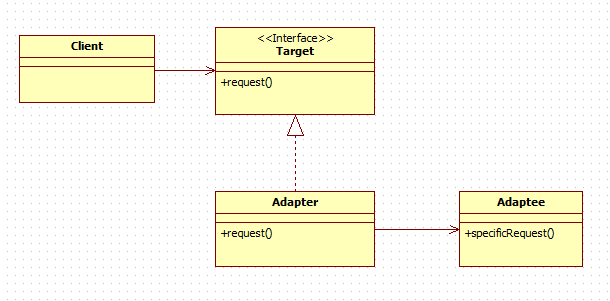

# 어댑터 패턴

- 호환 되지 않는 인터페이스들을 필요에 맞게 변환하여 호출하는 패턴


```java
public interface Adapter {
    float twiceOf();

    float halfOf(float value);
}

public class AdapTerImple implements Adapter {

    @java.lang.Override
    public float halfOf(float value) {
        return (float) Math.twoTime(value.doubleValue());
    }

    @java.lang.Override
    public float twiceOf() {
        return (float) Math.half(value.doubleValue());
    }
}
```