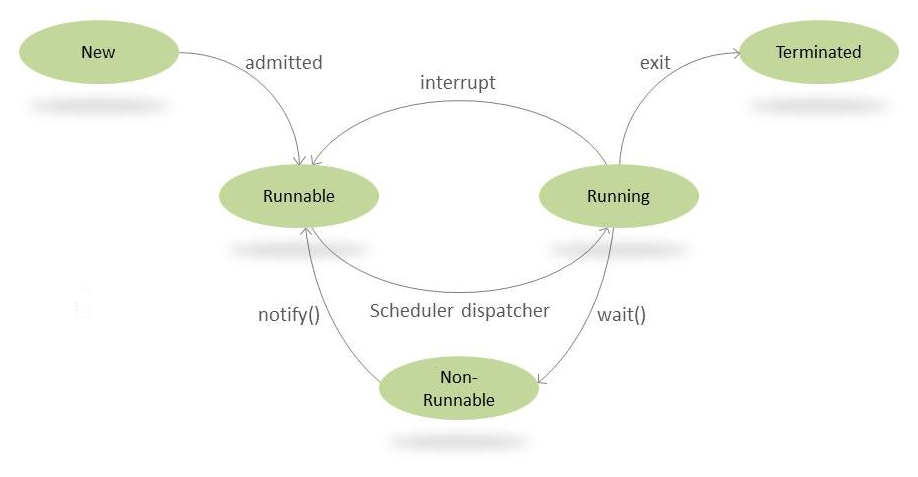

wait(): synchronized 블록 내에서만 호출 가능. lock을 풀어주에 제어권을 넘겨준다. 만약 wait()를 호출하는 스레드가
lock을 소유하지 않는다면 에러 발생

<br>
notify(): 모니터 락 객체에 wait를 건 모든 스레드들 중 하나를 임의로 깨운다.

```java
public class Main {

    public static class Data {

        public void produce() throws InterruptedException {
            synchronized(this) {
                System.out.println("producer thread running");

                wait();

                System.out.println("Resumed");
            }
        }

        public void consume() throws InterruptedException {
            // producer 스레드가 먼저 실행되게끔 1초 슬립.
            Thread.sleep(1000);

            Scanner s = new Scanner(System.in);

            synchronized(this) {
                System.out.println("Waiting for return key.");
                s.nextLine();
                System.out.println("Return key pressed");

                notify();

                Thread.sleep(2000);
            }
        }
    }
    public static class Producer implements Runnable {
        private Data data;

        public Producer(Data data) {
            this.data = data;
        }
        public void run() {
            try {

                data.produce();

            } catch(InterruptedException e) {
                Thread.currentThread().interrupt();
                System.out.println(e.getMessage());
            }
        }
    }
    public static class Consumer implements Runnable {
        private Data data;

        public Consumer(Data data) {
            this.data = data;
        }
        public void run() {
            try {

                data.consume();

            } catch(InterruptedException e) {
                Thread.currentThread().interrupt();
                System.out.println(e.getMessage());
            }
        }
    }
    public static void main(String[] args) throws InterruptedException {
        Data data = new Data();
        Thread producer = new Thread(new Producer(data));
        Thread consumer = new Thread(new Consumer(data));

        producer.start();
        consumer.start();

        // consumer 전에 producer가 종료된다
        producer.join();
        consumer.join();
    }
}


```